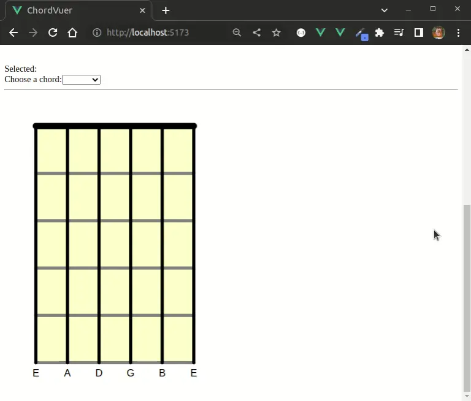

# chordvuer

Display guitar chords, with animated transitions between chords.

## Project Setup

```sh
npm install
```

### Compile and Hot-Reload for Development

```sh
npm run dev
```

### Compile and Minify for Production

```sh
npm run build
```

## Basic Usage

```html
<html>
<head>
  
  <script src="https://cdnjs.cloudflare.com/ajax/libs/vue/3.2.36/vue.global.prod.min.js"></script>
  <script src="./dist/chordvuer.umd.js"></script>
  <link rel="stylesheet" href="./dist/style.css">

  <style>
    .chord {
      height: 543px; 
      width:  400px; 
    }
  </style>
</head>
<body>
  <div id="app">
    <div>
    <label for="chord-name">Chord: </label>
    <select v-model="selected">
      <option v-for="(v, k) in chords" :value="k" :key="k" :selected="selected" >
       {{ v.name }}
      </option>
    </select>
    <hr>
    <guitar-chord id="chord1" v-bind:chord="chords[this.selected]"></guitar-chord>
    </div> 
  </div>

  <script>
    const app = Vue.createApp({
      data () {
        return {
          selected: "A"
        }
      }
    })
    app.config.globalProperties.chords = window.chordvuer.chords;
    app.component('guitar-chord', chordvuer.GuitarChord)
    app.mount('#app')
  </script>
</body>
</html>
```

