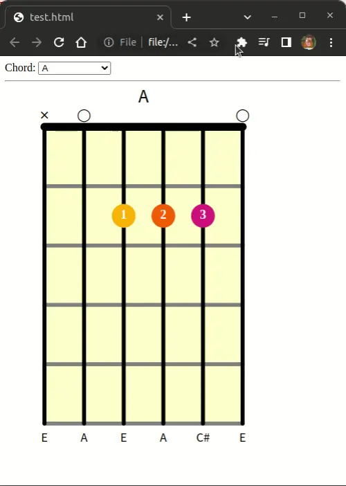

# chordvuer

Display guitar chords, with animated transitions between chords.



## Project Setup

```sh
npm install
```

### Compile and Hot-Reload for Development

```sh
npm run dev
```

### Compile and Minify for Production

```sh
npm run build
```

## Basic Usage

```html
<html>
<head>
  
  <script src="https://cdnjs.cloudflare.com/ajax/libs/vue/3.2.36/vue.global.prod.min.js"></script>
  <script src="dist/chordvuer.umd.js"></script>
  <link rel="stylesheet" href="./dist/style.css">

  <style>
    .chord {
      height: 543px; 
      width:  400px; 
    }
  </style>
</head>
<body>
  <div id="app">
    <chord 
      id="chord1"
      :chord='chords.Gmaj'
    ></chord>
  </div>

  <script>
    const app = Vue.createApp({})
    app.config.globalProperties.chords = window.chordvuer.chords;
    app.component('chord', chordvuer.Chord)
    app.mount('#app')
  </script>
</body>
</html>
```

